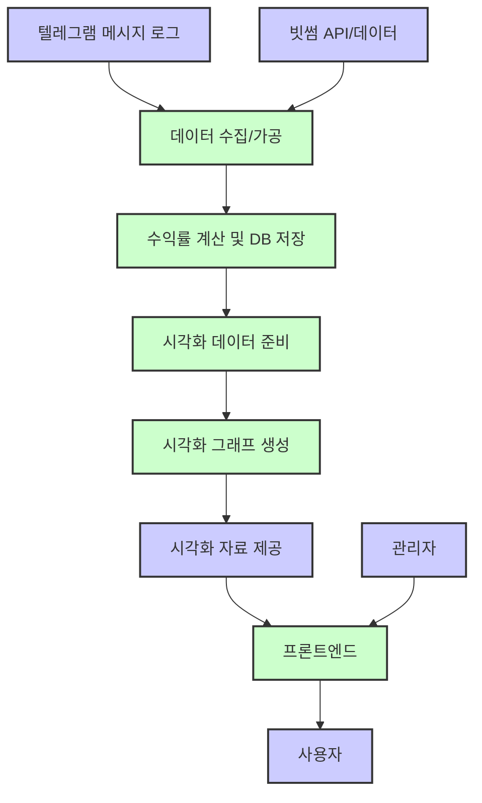

# 빅시그널 자동매매 시스템

텔레그램 메시지를 기반으로 한 자동매매 시그널 분석 및 포트폴리오 시뮬레이션 시스템입니다.

## 설치 방법

1. Python 3.8 이상이 필요합니다.
2. 필요한 패키지 설치:
```bash
pip install -r requirements.txt
```

## 환경 설정

1. 텔레그램 API 설정:
   - https://my.telegram.org 에서 API ID와 API Hash를 발급받으세요.
   - `.env` 파일을 생성하고 다음 내용을 입력하세요:
   ```
   TELEGRAM_API_ID=your_api_id
   TELEGRAM_API_HASH=your_api_hash
   TELEGRAM_PHONE=your_phone_number
   TELEGRAM_CHANNEL=your_channel_username
   ```

## 사용 방법

1. 텔레그램 메시지 수집:
```bash
python telegram_message_processor.py
```

2. 포트폴리오 분석:
```bash
python portfolio_analyzer.py
```

## 시스템 구조

1. `telegram_message_processor.py`: 텔레그램 메시지 수집 및 파싱
2. `portfolio_analyzer.py`: 포트폴리오 시뮬레이션 및 분석
3. `trades.csv`: 수집된 거래 데이터
4. `all_portfolio_pnl_summary.json`: 포트폴리오 분석 결과

## 주의사항

- 텔레그램 API 키는 절대 공개하지 마세요.
- 메시지 형식이 변경되면 정규표현식 패턴을 업데이트해야 합니다.
- CSV 파일은 자동으로 생성되며, 기존 파일이 있으면 추가 모드로 동작합니다.

## 프로젝트 구조

```
BigSignal/
├── client/                 # React 프론트엔드
│   ├── package.json
│   └── .env
├── server/                # Node.js 백엔드
│   ├── package.json
│   └── .env
├── analysis/             # 파이썬 분석 코드
│   ├── requirements.txt
│   └── .env
├── .gitignore
└── README.md
```

## 시스템 요구사항

- Node.js >= 16.x
- Python >= 3.8
- npm >= 8.x
- pip >= 21.x

## 시작하기

### 환경 설정
1. Firebase 프로젝트 설정
   - Firebase Console에서 새 프로젝트 생성
   - Firebase CLI 설치: `npm install -g firebase-tools`
   - 프로젝트 초기화: `firebase init`

2. 환경 변수 설정
   - 각 디렉토리의 `.env.example` 파일을 `.env`로 복사
   - 필요한 환경 변수 값 설정

### 프론트엔드 (React)
```bash
cd client
npm install
npm start
```

### 백엔드 (Node.js)
```bash
cd server
npm install
npm run dev
```

### 데이터 분석 (Python)
```bash
cd analysis
pip install -r requirements.txt
jupyter notebook
```

## 기술 스택
- 프론트엔드: React.js
- 백엔드: Node.js, Firebase Cloud Functions
- 데이터베이스: Firebase Realtime Database
- 데이터 분석: Python (pandas, matplotlib, seaborn)
- 배포: Firebase Hosting
- 버전 관리: Git
- 테스트: Jest (프론트엔드), Mocha (백엔드), Pytest (파이썬)

## 개발 가이드라인
- 코드 스타일: ESLint (프론트엔드/백엔드), Black (파이썬)
- 커밋 메시지: Conventional Commits
- 브랜치 전략: Git Flow

## API 문서
- Swagger UI: `http://localhost:3000/api-docs`
- Postman Collection: `docs/postman_collection.json`

## 라이선스
MIT License

## 프로젝트 견적


